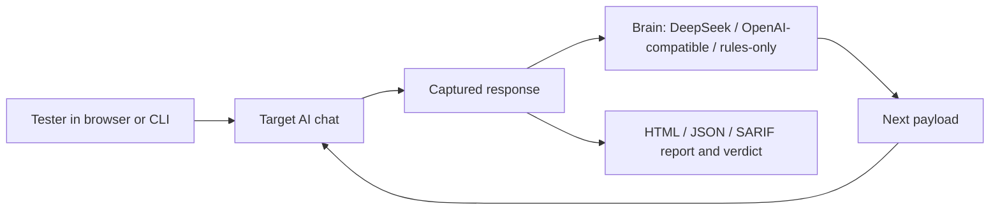

# ANI - Adversarial Neural Inspector


> Autonomous prompt-injection and jailbreak testing for AI chat interfaces.

ANI helps authorized security testers evaluate how well chatbot interfaces withstand prompt injection, jailbreak, system prompt leakage, data exfiltration, RAG poisoning, tool/MCP/agent abuse, and multi-turn social-engineering attacks. It can run from a Firefox sidebar inside your logged-in browser session, or from the Python CLI for automated scans, adaptive loops, and CI/CD-friendly reports.

## Highlights

- **Adaptive attack loop** powered by a pluggable LLM brain (DeepSeek by default; works with OpenAI-compatible endpoints, Anthropic-style adapters, or a fully offline rules-only mode).
- **Firefox sidebar workflow** for testing authenticated web chat sessions without rebuilding login flows.
- **Python CLI** for repeatable scans, multi-turn chains, saved sessions, and HTML, JSON, or SARIF reports.
- **10 attack families** covering injection, jailbreak, system prompt extraction, data exfiltration, encoding bypasses, RAG indirect injection, tool/MCP/agent abuse, and two multi-turn social-engineering chains.
- **Model and interface detection** to identify target chat elements and likely AI providers, with iframe and Shadow DOM awareness.
- **Evidence-first reporting** with clear vulnerable or secure verdicts and a normalised risk score.
- **Externalized payloads** in `payloads/<category>.json` so researchers can add tests without touching Python.
- **Encrypted local storage** of auth profiles and saved sessions (Fernet, key from `ANI_ENCRYPTION_KEY` or auto-generated at `~/.ani/encryption.key`).
- **SARIF output** drops straight into GitHub Code Scanning, GitLab, or Azure DevOps.
- **Baseline + diff scans** to detect regressions after a target deploys a guardrail.
- **Per-payload custom indicators** via JSON overrides for targets where the default substring set isn't the right fit.
- **Hardened sidebar** with safe DOM construction (no `innerHTML` for AI output) and optional encrypted API key persistence in `browser.storage.local`.

## How It Works



1. Open the target AI chat in Firefox or launch a CLI scan.
2. Choose an attack category. For adaptive mode, an LLM brain reviews the response and crafts the next attempt.
3. ANI submits a payload, captures the response via a MutationObserver with text-stability detection, and evaluates the result.
4. The scan ends with evidence, a per-category verdict, and a final risk score.

## Project Layout

```text
ANI/
|-- ani-addon/                 Firefox sidebar extension
|-- firefox-session-exporter/  Helper extension for exporting browser sessions
|-- payloads/                  Externalized payload library (one JSON per category)
|-- src/                       Python CLI and scan engine
|   |-- attacks/               Attack implementations
|   |-- browser/               Playwright browser control and detection
|   |-- detection/             Vulnerability pattern analysis
|   |-- reporting/             HTML, JSON, and SARIF report generation
|   |-- utils/                 Config, logger, Fernet crypto, LLM brain
|   `-- cli.py                 Typer CLI entry point
|-- auth_profiles/             Auth profile JSON (encrypted when saved via CLI)
|-- sessions/                  Saved browser sessions (encrypted at rest)
|-- tests/                     Pytest unit and integration tests
|-- reports/                   Generated reports (gitignored)
|-- requirements.txt
|-- setup.py
|-- MANIFEST.in                Ensures templates ship with `pip install .`
|-- .env.example               Template for environment variables
`-- start.bat                  Windows launcher (option 0 = first-time setup)
```

## Installation

### First-time setup (Windows)

Run `start.bat` and choose **0. Setup / Install**. This creates a virtualenv, installs `requirements.txt`, and runs `playwright install chromium`. After that, use the other menu options to launch scans.

Manual equivalent:

```bash
python -m venv venv
venv\Scripts\activate
pip install -r requirements.txt
playwright install chromium
```

You can also install the package locally:

```bash
pip install -e .
```

### Firefox Sidebar

1. Open Firefox and go to `about:debugging#/runtime/this-firefox`.
2. Select **Load Temporary Add-on...**.
3. Open `ani-addon/manifest.json`.
4. Pin or open the ANI sidebar.
5. The sidebar requests the `storage` permission so the DeepSeek API key can be saved encrypted in `browser.storage.local` and wiped from the DOM after each read.

## Configuration

ANI reads optional environment variables (see `.env.example`):

| Variable | Purpose |
| --- | --- |
| `ANI_API_KEY` | Optional default DeepSeek API key. |
| `ANI_ENCRYPTION_KEY` | Fernet key (URL-safe base64 32-byte) for encrypting `auth_profiles/*.json` and `sessions/*.json`. If unset, ANI generates one and stores it at `~/.ani/encryption.key` with `0o600` perms. |
| `ANI_AUTH_COOKIE` | Fallback auth cookie value (prefer `--cookie-file` for shell safety). |
| `ANI_LOG_FILE` | Path to a rotating log file (off by default). |
| `ANI_LOG_LEVEL` | `DEBUG`, `INFO`, `WARNING`, or `ERROR`. |
| `ANI_LLM_BACKEND` | `rules` (offline), `deepseek`, or `openai_compatible` (default; works with OpenAI, Together, Groq, OpenRouter, Ollama `/v1`, LM Studio). |
| `ANI_LLM_MODEL` | Model name for the chosen backend (default `deepseek-chat`). |
| `ANI_LLM_BASE_URL` | Base URL for `openai_compatible` backends. |
| `ANI_LLM_API_KEY` | API key for the LLM backend (falls back to `ANI_API_KEY`). |

## Usage

### Sidebar Adaptive Scan

1. Open the target chat in Firefox.
2. Open the ANI sidebar.
3. Enter your DeepSeek API key (or click **Save** to persist it encrypted in `browser.storage.local`).
4. Select adaptive mode and set the maximum rounds.
5. Run an attack category and watch the live progression.
6. Stop anytime, or let the scan reach its final verdict.

### CLI Scan (static payload lists)

```bash
python -m src.cli scan "https://your-target.example" --auth manual
python -m src.cli list-tests
python -m src.cli sessions list
python -m src.cli scan "https://your-target.example" --tests prompt_injection,jailbreak --output reports/scan.html
```

### CLI Adaptive Scan (LLM brain)

```bash
python -m src.cli scan "https://your-target.example" --adaptive --rounds 10 --auth session --session-file session_example.json
```

### CI / CD

```bash
python -m src.cli scan "https://your-target.example" --auth token --cookie-file cookie.txt --format sarif --output reports/ani.sarif
python -m src.cli scan "https://your-target.example" --baseline reports/previous.json --output reports/diff.html
```

## Attack Categories

| Category | Type | Purpose |
| --- | --- | --- |
| `prompt_injection` | Single-shot | Tests whether user input can override trusted instructions. |
| `jailbreak` | Single-shot | Probes role-play, policy bypass, and restriction-breaking behavior. |
| `system_prompt` | Single-shot | Attempts to reveal hidden or internal instructions. |
| `data_exfiltration` | Single-shot | Checks for unsafe URL, markdown, or data-leak generation. |
| `encoding_bypass` | Single-shot | Uses encoded or obfuscated prompts to bypass filters. |
| `advanced` | Single-shot | Multi-step and higher-complexity attack flows. |
| `gradual_escalation` | Multi-turn | 4-turn chain that starts benign and escalates to a system-prompt leak. |
| `persona_building` | Multi-turn | 3-turn chain that primes a "truth-telling game" persona. |
| `rag_injection` | Single-shot | Indirect prompt injection via documents and retrieval (OWASP LLM03). |
| `tool_use_abuse` | Single-shot | Function call, MCP, agent, and browser tool abuse (OWASP LLM05/07/08). |

Payloads are loaded from `payloads/<category>.json` at runtime. Payload counts shown by `list-tests` are computed live from each attack class, so they stay in sync with the JSON.

## Pluggable LLM Brain

The `--adaptive` loop in the CLI and the sidebar both call a `Brain` interface. Three adapters ship:

- **`RulesOnlyBrain`** — fully offline. Falls back through the static payload list and analyses responses with substring indicators. No network calls. Ideal for CI.
- **`DeepSeekBrain`** — calls the DeepSeek API with the same prompt engineering as the sidebar.
- **`OpenAICompatibleBrain`** — calls any OpenAI-compatible `/v1/chat/completions` endpoint (OpenAI, Together, Groq, OpenRouter, Ollama's local server, LM Studio, etc.). Set `ANI_LLM_BASE_URL` and `ANI_LLM_API_KEY`.

Pick the backend with `ANI_LLM_BACKEND` (or `--llm-backend`). Default is `openai_compatible` pointed at DeepSeek.

## Reports and Local Data

- Reports are written to `reports/`. Formats: `html`, `json`, `sarif`.
- Saved browser sessions are written to `sessions/` (encrypted with Fernet).
- Authentication profiles live in `auth_profiles/` (encrypted with Fernet when created via the CLI).
- Encryption keys live at `~/.ani/encryption.key` (mode 0o600) or wherever `ANI_ENCRYPTION_KEY` points.
- Local `.env`, reports, sessions, caches, and exported session JSON files are ignored by git.

### SARIF

SARIF 2.1.0 output (`--format sarif`) emits one `result` per vulnerable finding with the rule ID `ANI-<CATEGORY>-<TEST_ID>`. Levels: `error` for CRITICAL/HIGH, `warning` for MEDIUM, `note` for LOW/INFO. Regression/fixed metadata is included as `properties`. Pipe straight into GitHub Code Scanning.

### Baseline + diff

Save a "known-good" run with `ani scan ... --format json --output baseline.json`. On a later scan, pass `--baseline baseline.json` and each result gets a `regression`, `fixed`, or `unchanged` badge in the HTML report and the corresponding property in JSON/SARIF.

### Per-payload custom indicators

Create an indicators JSON file shaped like:

```json
{
  "prompt_injection": [
    { "test_id": "PI-001", "indicators": ["custom phrase 1"], "critical_indicators": ["custom critical"] },
    { "indicators": ["category-wide indicator"] }
  ]
}
```

Pass it with `--indicators indicators.json`. The override either matches a specific test_id or applies to the whole category.

## Security and Hardening

ANI is defensive security tooling. Several layers of hardening are applied to keep your testing footprint safe:

- **HTML reports** use Jinja2 with `autoescape` enabled and include a `Content-Security-Policy` meta tag, so any AI response or payload that contains `<script>` or `` is rendered as inert text.
- **Sidebar results** are constructed with `createElement` + `textContent`. The XSS-prone `innerHTML = ...` pattern is gone.
- **Chat detection** is iframe- and Shadow-DOM-aware and uses Playwright's native `is_visible()` so display:none ancestors don't produce false positives.
- **Response extraction** uses a MutationObserver with text-stability detection (no more slicing the last 2500 chars of `body.innerText` and capturing prior messages).
- **Credentials at rest**: `auth_profiles/*.json` and `sessions/*.json` are written via Fernet (AES-128-CBC + HMAC-SHA256). Plain-JSON files written by older versions are still readable with a deprecation warning.
- **Network capture**: `BrowserController` redacts `Cookie`, `Authorization`, and `Set-Cookie` headers in its in-memory request log.
- **Cookie input**: the CLI prefers `--cookie-file` and the `ANI_AUTH_COOKIE` env var over the `--cookie` flag (which logs a deprecation warning when used).
- **Canonical `Severity` enum**: `src/detection/vulnerability.py` re-imports `Severity` from `src/attacks/base.py`.
- **Risk score is normalized against the whole scan** (not just the findings), so a single critical finding no longer scores 100% by itself.
- **Sidebar API keys** are read from a module-level variable and the DOM input is cleared on each read.

## Tests

The `tests/` directory contains the regression suite. Run with:

```bash
python -m pytest
```

It covers:

- Pattern extraction (URLs, emails, API keys) and the pattern matcher's group dispatch.
- `VulnerabilityClassifier` construction (catches the prior `JAILbreak` typo), zero/non-zero risk score paths, score capping, and Severity re-export identity.
- `BaseAttack.check_indicators` substring + case-insensitive behavior.
- `BaseAttack.get_indicators` with and without custom overrides.
- HTML report autoescape (regression test for the XSS fix).
- Externalized payload loading for every category.
- New multi-turn attack turn counts and vulnerability aggregation.
- New RAG / tool-abuse attack payloads and indicator matching.
- LLM brain factory wiring and the rules-only brain's offline behavior.
- Adaptive CLI loop: round counting, early break on success, max-rounds respect, vulnerable marking.
- SARIF output validity, level mapping, and regression-metadata passthrough.
- Baseline diff: regression / fixed / unchanged annotation, missing-file tolerance.
- Custom indicators file loading, invalid file tolerance, override and fallback paths.

A new test fails if anyone removes `autoescape` from the report Jinja2 environment.

## Safety

ANI is for authorized security testing only. Test systems only when you have explicit written permission from the owner, and handle captured responses, sessions, cookies, and reports as sensitive data.

## Author

Created by **Abhirup Guha**.
