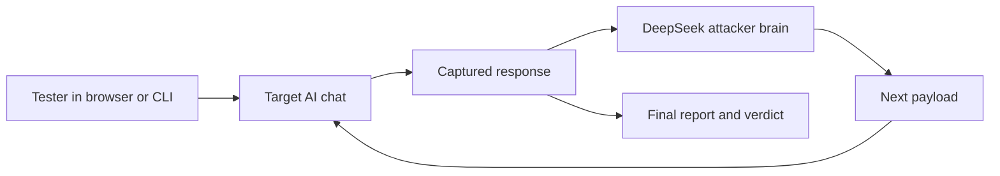

# ANI - Adversarial Neural Inspector

> Autonomous prompt-injection and jailbreak testing for AI chat interfaces.

ANI helps authorized security testers evaluate how well chatbot interfaces withstand prompt injection, jailbreak, system prompt leakage, and data exfiltration attempts. It can run from a Firefox sidebar inside your logged-in browser session, or from the Python CLI for automated scans and reports.

## Highlights

- **Adaptive attack loop** powered by DeepSeek, which reviews target responses and crafts follow-up attempts.
- **Firefox sidebar workflow** for testing authenticated web chat sessions without rebuilding login flows.
- **Python CLI** for repeatable scans, saved sessions, and HTML or JSON reports.
- **Multiple attack families** covering injection, jailbreak, system prompt extraction, data exfiltration, encoding bypasses, and advanced flows.
- **Model and interface detection** to identify target chat elements and likely AI providers.
- **Evidence-first reporting** with clear vulnerable or secure verdicts.

## How It Works



1. Open the target AI chat in Firefox or launch a CLI scan.
2. Choose an attack category and, when using the sidebar, enter your DeepSeek API key.
3. ANI submits a payload, captures the response, and evaluates the result.
4. In adaptive mode, DeepSeek uses the response to craft the next attempt.
5. The scan ends with evidence and a final verdict.

## Project Layout

```text
ANI/
|-- ani-addon/                 Firefox sidebar extension
|-- firefox-session-exporter/  Helper extension for exporting browser sessions
|-- payloads/                  JSON payload libraries
|-- src/                       Python CLI and scan engine
|   |-- attacks/               Attack implementations
|   |-- browser/               Playwright browser control and detection
|   |-- detection/             Vulnerability pattern analysis
|   |-- reporting/             Console and HTML report generation
|   `-- cli.py                 Typer CLI entry point
|-- auth_profiles/             Example auth profile and local profiles
|-- sessions/                  Local saved browser sessions
|-- requirements.txt
|-- setup.py
`-- start.bat                  Windows launcher
```

## Installation

### Firefox Sidebar

1. Open Firefox and go to `about:debugging#/runtime/this-firefox`.
2. Select **Load Temporary Add-on...**.
3. Open `ani-addon/manifest.json`.
4. Pin or open the ANI sidebar.

### Python CLI

```bash
python -m venv venv
venv\Scripts\activate
pip install -r requirements.txt
playwright install chromium
```

You can also install the package locally:

```bash
pip install -e .
```

## Usage

### Sidebar Adaptive Scan

1. Open the target chat in Firefox.
2. Open the ANI sidebar.
3. Enter your DeepSeek API key.
4. Select adaptive mode and set the maximum rounds.
5. Run an attack category and watch the live progression.
6. Stop anytime, or let the scan reach its final verdict.

### CLI Scan

```bash
python -m src.cli scan "https://your-target.example" --auth manual
```

Useful options:

```bash
python -m src.cli list-tests
python -m src.cli sessions list
python -m src.cli scan "https://your-target.example" --tests prompt_injection,jailbreak --output reports/scan.html
python -m src.cli scan "https://your-target.example" --auth session --session-file session_example.json
```

## Attack Categories

| Category | Purpose |
| --- | --- |
| `prompt_injection` | Tests whether user input can override trusted instructions. |
| `jailbreak` | Probes role-play, policy bypass, and restriction-breaking behavior. |
| `system_prompt` | Attempts to reveal hidden or internal instructions. |
| `data_exfiltration` | Checks for unsafe URL, markdown, or data-leak generation. |
| `encoding_bypass` | Uses encoded or obfuscated prompts to bypass filters. |
| `advanced` | Runs multi-step and higher-complexity attack flows. |

## Reports and Local Data

- Reports are written to `reports/`.
- Saved browser sessions are written to `sessions/`.
- Authentication profiles live in `auth_profiles/`.
- Local `.env`, reports, sessions, caches, and exported session JSON files are ignored by git.

## Safety

ANI is for authorized security testing only. Test systems only when you have explicit written permission from the owner, and handle captured responses, sessions, cookies, and reports as sensitive data.

## Author

Created by **Abhirup Guha**.
